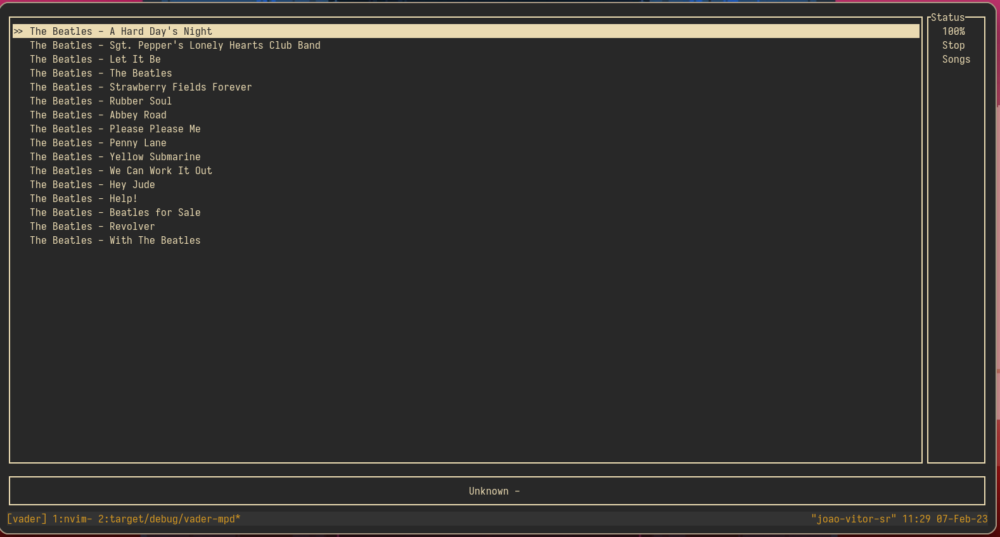

Deprecated use [mms](https://github.com/joao-vitor-sr/mms) instead
# Vader
The Dark Side of the Force is a pathway to many abilities, some consider to be unnatural.



## About
Vader is a terminal based mpd client (written fully in rust 🦀)

## Installation

to build vader:
```
git clone https://github.com/joao-vitor-sr/vader
cd vader
cargo build --release
./target/release/vader
```
